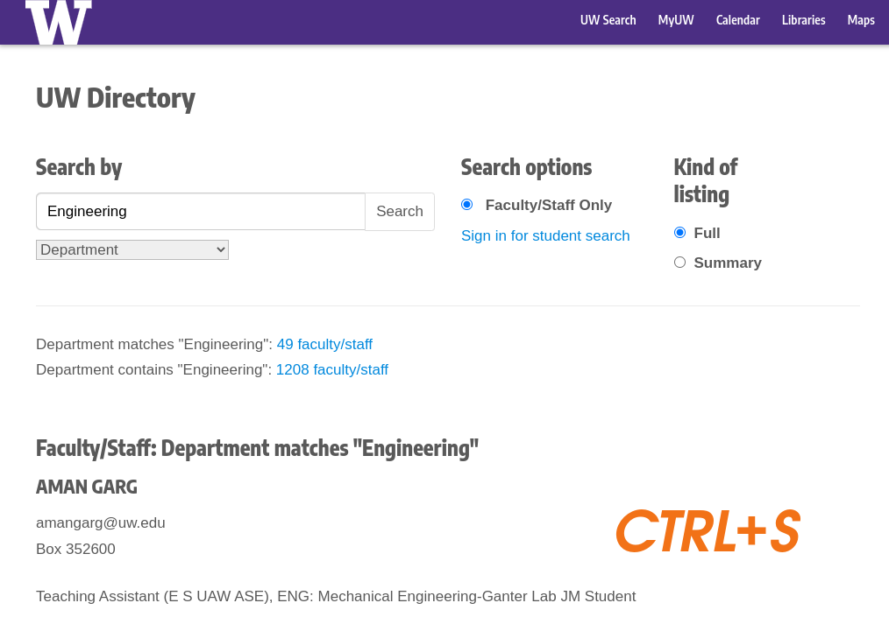
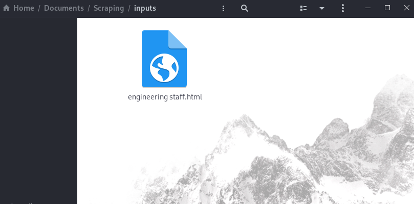

# DUBScrape

## Table of Contents
  - [Table of Contents](#table-of-contents)
  - [General Info](#general-info)
  - [Technologies](#technologies)
  - [How To](#how-to)
  - [Setup](#setup)

## General Info
Convert any number of UW directory searches into a single comprehensive CSV file.

## Technologies
This project is created with:
- [Numpy](https://numpy.org/): 1.21.4
- [Gender-AI](https://github.com/leophagus/gender_ai/): 3b9cbe6

## How To
Perform any number of searches and save the webpage.


Now, just move the `.html` file into the inputs directory


Run `main.py` and the `output.csv` file will be created.
\
\

## Setup
Clone the Repo \
```git clone https://github.com/Pop101/DUBScrape``` \
Enter the Repo and Install requirements \
```cd DUBScrape && sudo python3 -m pip install -r requirements``` \
Run and Enjoy! \
```python3 main.py```